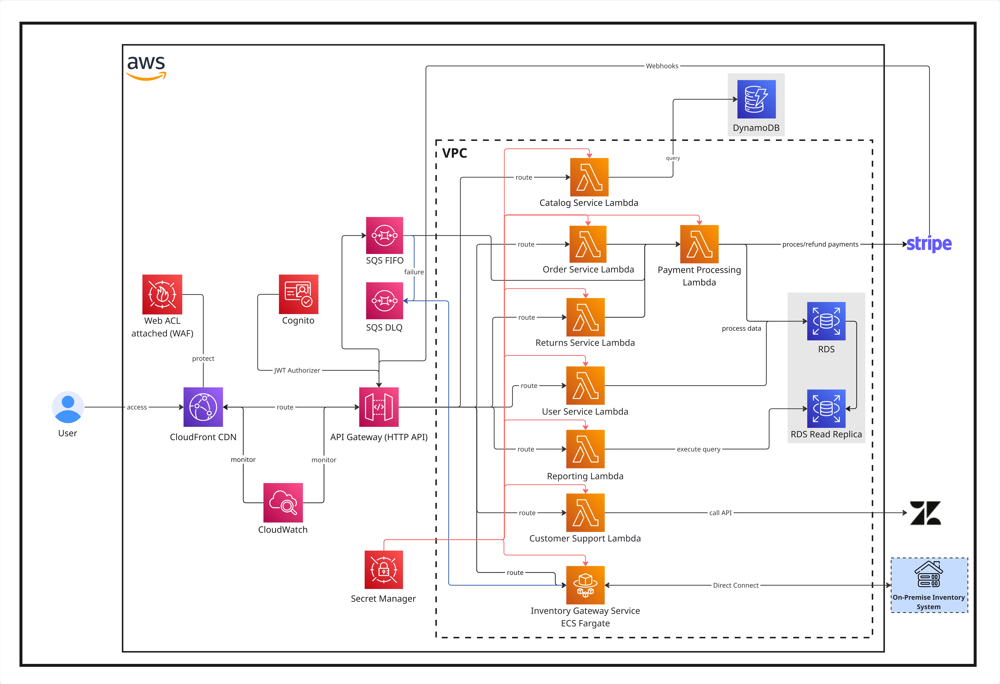
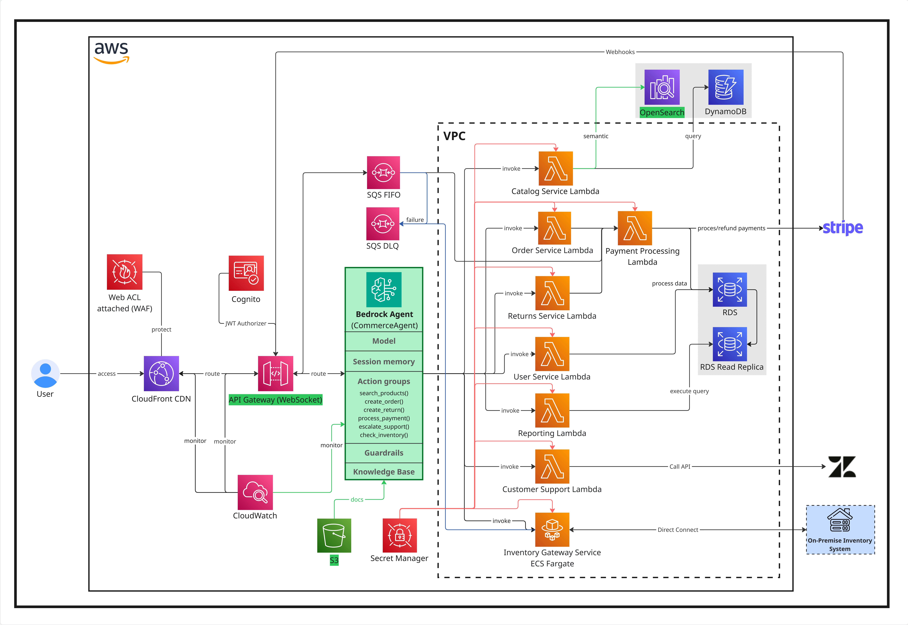

Today, I'd like to share how I personally think about system design. I am exploring whether agentic software really makes sense for a small product-based company that wants to enter the online market.

This is part of my current semester module, and here I am mostly thinking in architecture terms.

Comparing two worlds:
- A traditional cloud-native serverless system
- An AI-native agentic system

Both are built on AWS. Both are realistic. But their philosophy is very different.

## My Assumptions

I am imagining a small traditional company that:
- Is well established in a local physical market
- Wants to enter online gradually
- Has legacy inventory software running on-premises
- Wants minimal upfront cost
- Expects ~5,000 orders per month initially
- Wants basic analytics for decision making
- Prefers managed services over infrastructure management

I am intentionally choosing cloud-native serverless because I do not want the company to waste time managing servers. I want them to focus on business, not hardware.

## Part 1 — The Traditional Cloud-Native System
This architecture has a classic serverless e-commerce backend.

### Why I Choose Serverless
Serverless is preferable because:
- No EC2 maintenance
- No scaling headaches
- Automatic elasticity
- Global availability
- Pay-per-use pricing

For a small company, this reduces operational complexity dramatically.

### How I Imagine the Flow

The user enters the platform through **CloudFront CDN**, which reduces latency globally. **AWS WAF** is attached to CloudFront to protect against common web attacks (SQL injection, bots, etc).

**Amazon Cognito** is used for authentication. I like Cognito because it handles JWT tokens, user pools, login via email/phone, and removes the need to build auth from scratch.

Next, **API Gateway (HTTP API)** as the central routing layer. I think of it as the managed entry door to all backend services.

Inside a dedicated VPC, multiple **AWS Lambda** functions run:
- Catalog Service Lambda
- Order Service Lambda
- Payment Processing Lambda
- Returns Service Lambda
- User Service Lambda
- Reporting Lambda
- Customer Support Lambda

I use **DynamoDB** for catalog data because it scales automatically and works well for product listings.

**Amazon RDS (PostgreSQL)** for transactional data like orders and users because it provides relational consistency.

For payments, I integrate with **Stripe** using webhooks. In addition, **SQS FIFO** to handle asynchronous payment confirmation and retries. If failures exceed retry limits, messages are pushed to **SQS DLQ**.

**Zendesk API** from Lambda for customer support. 

For legacy inventory, I use an **ECS Fargate** Inventory Gateway Service that connects via Direct Connect (or secure hybrid connectivity) to the on-prem inventory system.

I store secrets in AWS Secrets Manager and monitor logs and metrics using **CloudWatch**.

### Why This Architecture Works
This architecture is:
- Deterministic
- Predictable
- Operationally safe
- Automatic scaling

The availability is high because:
- CloudFront is globally distributed
- Lambda scales horizontally
- DynamoDB is multi-AZ default
- RDS can be multi-AZ

Security-wise:
- WAF protects edge
- IAM roles enforce least privilege
- Cognito handles authentication
- Secret Manager avoids hardcoded credentials
- VPC isolates compute

which is production-grade and realistic.

## Part 2 — The Agentic AI-Native System

> Now I ask myself: what if the entire front-end interaction becomes conversational?
> Instead of navigating pages, I imagine the user chatting with an AI commerce assistant.

### Why I consider Agents
Agents make sense for:
- Natural interaction
- Personalization 
- Workflow automation
- Reasoning over structured + unstructured data

But they also introduce cost and complexity :/

### How I Imagine the Agentic Flow

Keep **CloudFront** + **WAF** + **Cognito** same. Security fundamentals do not change. 

**HTTP API** is replaced with **WebSocket API** and **AWS Bedrock Agent** as the brain.

The agent consists of:
- A selected foundational model
- System instructions (commerce-specialized prompt)
- Guardrails
- Session memory
- Knowledge base
- Action groups (tools)

I let Bedrock manage session memory (internally backed by DynamoDB).

Important part: Action Groups that map to backend tools:
- `search_products()` -> Catalog Lambda
- `create_order()` -> Order Lambda
- `create_return()` -> Return Lambda
- `process_payment()` -> Payment Lambda
- `check_inventory()` -> Inventory Lambda
- `escalate_support()` -> Customer Support Lambda

Now the key difference:
> The agent decides which Lambda to invoke.

### Semantic Search Upgrade
In the traditional system, catalog search is keyword-based.

In the agentic version, **Amazon OpenSearch (vector search)** enables semantic search. 

Imagine:
- User says "I want something comfortable for winter hiking under €100."
- The agent converts it to embedding.
- OpenSearch returns semantically relevant products.
- If nothing matches, fallback to DynamoDB.

This is a major UX improvement. 

### Knowledge Base & FAQs

Let's assume that the company documents and FAQs are uploaded into **S3**, which feeds the Bedrock Knowledge Base.

Now the agent can:
- answer return policy questions.
- explain shipping timelines.
- escalate to Zendesk if needed.

This reduces human support load. 

### What Stays the Same

I kept:
- RDS for transactions
- SQS for async processing
- Stripe integration
- ECS Fargate for legacy inventory

> What is the difference then?
> Rather than replacing backend logic, the orchestration is changed, which is important. 

## Cost Estimation

**Assumptions (/month):**
- 10,000 active users
- 5,000 orders
- 100,000 API calls
- Average 2-3 LLM calls per user session (agentic system)
- Moderate data storage

| System | Estimated Total (/month) |
| --- | --- |
| Traditional | €175 – €245 |
| Agentic | €400 – €750 |

The additional cost for agentic system is heavily coming from **Bedrock** followed by **OpenSearch** (small cluster).

## Security Reflection:
Security remains strong in both cases. However, I must additionally worry about agentic system regarding:
- Prompt injection
- Data leakage via LLM
- Guardrail misconfiguration
- Model hallucination

So governance becomes more important.

## Feature Comparison

**Traditional System**:
- Deterministic
- Stable
- Easy to audit
- Lower cost
- Clear data flow

**Agentic System**:
- Conversational UX
- Personalized experience
- Semantic search
- Automated workflows
- Higher cost
- Higher uncertainty

## Verdict

I think traditional cloud-native systems are about control and agentic systems are about adaptability.

I believe small companies should first build a stable deterministic backbone. I would not replace the core transactional system with an LLM, but an agent can be layered on top once the system is stable. 

Agentic software makes sense when:
- Customer interaction complexity increases
- Support costs become high
- Personalization becomes competitive advantage

I don't think every small company immediately needs an agent, but I do think the market is changing. 

Overall, this is how I see it:

> Cloud-native is about abstracting servers, and AI-native is about abstracting workflows. 
